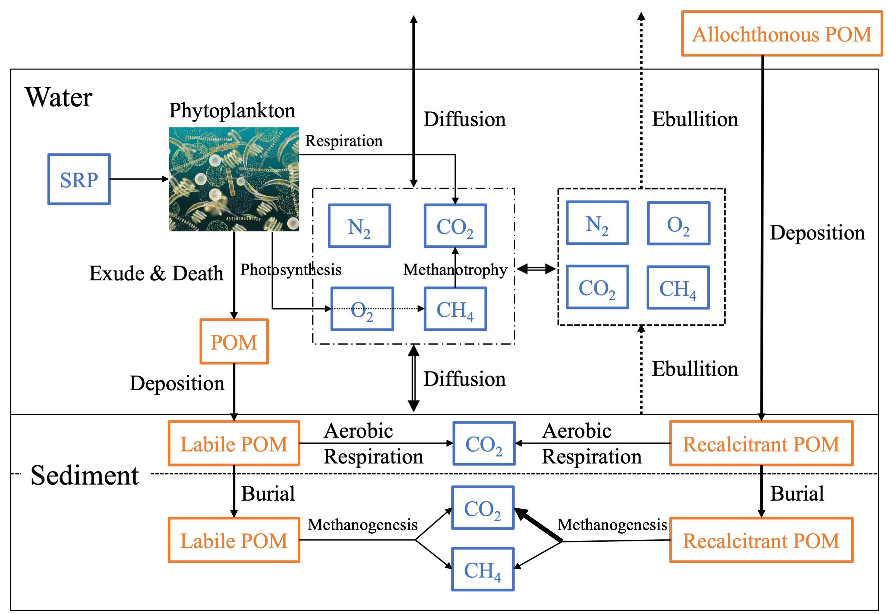
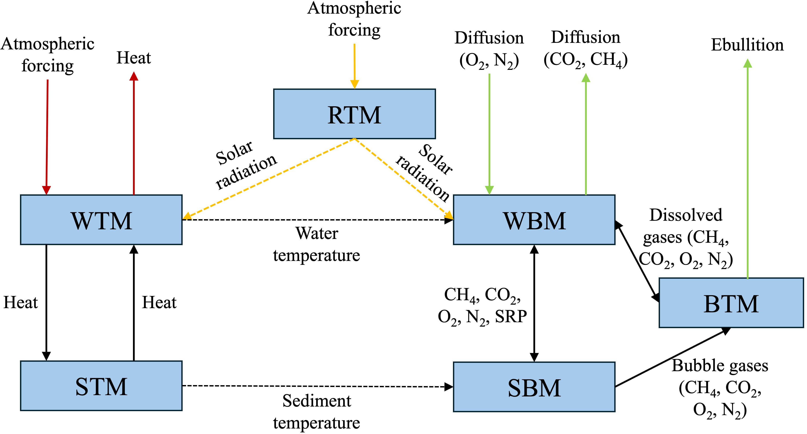

.. _ModelDescription:

Scientific Description
======================

Overview
--------

ALBM can simulate major physical, biogeochemical, and biological processes that are critical 
for lake CH₄ and CO₂ emissions (:numref:`fig-lake-schematic`).

.. _fig-lake-schematic:

   Schematic of lake physical, biogeochemical, and biological processes in ALBM.

ALBM has six modules: Water Thermal Module (WTM), Sediment Thermal Module (STM), 
Radiative Transfer Module (RTM), Water Biogeochemistry Module (WBM), Sediment Biogeochemistry Module (SBM), 
and Bubble Transport Module (BTM). The coupling scheme of these modules is illustrated in :numref:`fig-module-coupling`.

.. _fig-module-coupling:

   Schematic of the coupling between different modules in ALBM.

Model Modules
-------------

Water Thermal Module (WTM)
~~~~~~~~~~~~~~~~~~~~~~~~~~

The WTM module simulates water temperature and ice and snow phenology. It accounts for:

* Solar radiation penetration and absorption
* Convective mixing and turbulent diffusion
* Ice phenology (ice formation and melt)
* Snow phenology (snow accumulation and melt)
* Surface energy balance, including net heat flux at the water-air interface
* Bottom heat flux at the sediment-water interface

.. math::
   :label: eq-thermal-diffusion

   \frac{\partial T}{\partial t} = D \frac{\partial^2 T}{\partial z^2}

As shown in :eq:`eq-thermal-diffusion`, temperature evolves by diffusion.

Sediment Thermal Module (STM)
~~~~~~~~~~~~~~~~~~~~~~~~~~~~~

The STM module simulates sediment temperature and ice. It accounts for:

* Sediment heat storage and conduction
* Sediment ice formation and melt
* Surface energy balance at the sediment-water interface

Radiative Transfer Module (RTM)
~~~~~~~~~~~~~~~~~~~~~~~~~~~~~~~

The RTM module simulates solar radiation influx at the water surface. It accounts for:

* Downwelling solar radiation spectrum (forced by forcing data)
* Atmospheric gas absorption (CO₂, O₃) corrections
* Aerosol scattering and absorption corrections
* Surface albedo corrections (ice, snow, open water)

Water Biogeochemistry Module (WBM)
~~~~~~~~~~~~~~~~~~~~~~~~~~~~~~~~~~

The WBM module simulates the cycling of organic carbon, inorganic carbon, and nutrients
in the water column, including:

* Solar radiation transfer and light attenuation in the water column
* Primary production by phytoplankton
* Primary production by submerged aquatic vegetation (SAV)
* Metabolism of phytoplankton and SAV (growth, respiration, mortality)
* Oxic methane production
* Aerobic methane oxidation
* Heterotrophic respiration and carbon decomposition
* Dissolved gas transport and diffusive exchange with the atmosphere

Sediment Biogeochemistry Module (SBM)
~~~~~~~~~~~~~~~~~~~~~~~~~~~~~~~~~~~~~

The SBM module simulates the cycling of organic and inorganic carbon
in sediments, including:

* Methanogenesis
* Aerobic carbon decomposition
* Organic matter deposition
* Dissolved gas transport in pore water
* Bubble formation

Bubble Transport Module (BTM)
~~~~~~~~~~~~~~~~~~~~~~~~~~~~~

The BTM module represents bubble transport in the water column. Key processes include:

* Bubble dissolution in the water column
* Bubble rise and vertical transport in the water column
* Bubble emission to the atmosphere (ebullition)

Coordinate System and Resolution
---------------------------------

ALBM uses a one-dimensional vertical coordinate. The model domain is
divided into:

* ``NWLAYER`` water-column layers (default: 50)
* ``NSLAYER`` sediment layers (default: 40)
* ``NRLAYER`` riparian/run-off layers (default: 10)

These values can be modified in the ``[resolution]`` section of the
namelist file (see :ref:`Inputs`).
